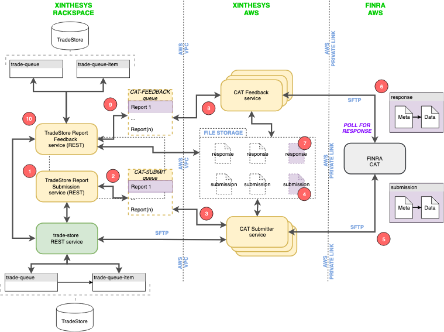

[Home](../README.md)
# Adept(tm) FINRA CAT Receiver Workflow

## Overview

The Adept FINRA CAT Receiver service responsibility is watch for any feedback files from the FINRA SFTP server and report to the feedback queue. Once the feedback file is received they are filtered for processing and update the response in the DB.
### Shared service and how this service is used across the domains

- FINRA CAT Receiver service is used as shared service for multiple domains. There can be multiple domains interacting with the service and it performs operations as per the domain it was invoked from. Let's for understanding assume there are two domains named CELADON and WEDBUSH. When the service watches and receives a new file from FINRA it looks for which domain the file is associated with and processes it accordingly.

### Deployment model for the service and how internal servers communicate

- This service requires the following to be installed/available before running.

    * xdata.dom1 configured to domain IP
    * bzip2 linux command
    * node.js
    * npm
    * pm2
    * git

The deployment model consists of 2 services running namely adept-paas.finra-cat-submitter and adept-paas.finra-cat-receiver service. These both services are run from PM2 daemon running in the background. The receiver service constantly watches for any changes in the FINRA SFTP server and notifies the service to process. This service connects to xdata.dom1 which is configured in /etc/hosts. The xdata.dom1 is used to connect the mongodb and redis.

### Notifications / Logging

This service logs all the important info and errors into the log file. It uses the inbuilt service logger using the service model package. For any report related info or error it publishes to the xinthesy's #finra-reporter-events channel.

Overall this service downloads finra response files when there are any new uploads or status files in the SFTP. This uses the underlying SFTPWatcher which runs in the background to check for any new response files. This automatically unpacks the files and updates the DB.

## Design

Stages of the data flow of the service.

#### FINRA

In this stage the FINRA processes the submission reports and returns the feedback to the SFTP server. The response file can be meta, meta.ack, ingestion or linkage errors. If there are errors they put them in errors directory if not they put them in the feedback directory. Then from here the AWS receiver takes over.

#### AWS

In this stage the service watches for any new responses in SFTP server. If there are any files the service fetches the file to the local directory and starts processing the response file. If there are any error feedback files it first unextracts the .bz2 file and starts processing. This service looks for the reportKey in the filename using the reportkey name it fetches the mongoDB configuration from the reportkeys.json file to connect. if there are no reportKey in the filename it looks for the domainMap configured in the etc config file.

#### XINTHESYS

In this stage the service updates the relevant DB statuses and from the UI Dashboard the report is viewed for any correction.

### Design goals

#### The goal of this service are as follows:

 * Finra SFTP Watcher
 * Ability to download feedback files and process it parallelly
 * Extract error .bz2 file
 * Handle the status of the trade report
 * Process and update all the responses in trade events and trade report events collection
 * Differentiate feedback files with linkage files

 ### Data flows

 The following diagram shows overall flow for FINRA receiver and FINRA receiver service.



The receiver process involves several phases/steps described below:

##### Phase 1 ( Poll for response )

In this phase a SFTP watcher is run on background to watch if there are any new files uploaded by FINRA. If there are any files in either feedback or errors directory then this service immediately downloads the file for processing. This service is made in such a way that it automatically reconnects if disconnected. And for any issue regarding the connection or exception it posts a message in slack channel.

##### Phase 2 ( Response files )

In this phase after downloading a valid feedback file. The service extracts error.bz2 file. After the extraction it then segregates linkage and other response files. If the file is a linkage file it checks for the imidmap configured in the etc/cat.receiver.config.json and matches the filename with desired domain and starts connecting the DB for processing. If the file is not a linkage file the service checks for the reportKey in the filename and then uses the reportKeys.json file for further processing and updating the DB.

##### Phase 3 ( Feedback service )

In this phase after extraction the trade events and trade report events collection is updated with response feedback. If its error feedback file then it updates the spec_data.response.errors and its count in the trade report collection along with response.dt. If it is not error feedback it updates the accepted count in trade report collection. This service makes sure it updates accepted count, rejected count, dt, has_errors and linkage count.

##### Phase 4 ( Feedback queue )

In this phase it fetches the feedback files from the queue and processes the feedback response into the DB. This service does the processing parallelly.

##### Phase 5 ( Tradestore Report Feedback REST API )

In this phase all the completed feedback responses are ready to make requests via the API. Here the trade report id is taken as an input to fetch the trade report response. And the API also supports trade file id and trade file content id as input.

## Installation and Running the service

[Preparation and running](./prepare.receiver.aws.vm.md)

# Folder Structure
  ```
  |-- docs
  |-- etc
  |-- files
  |-- model
  |-- src
     |-- cat-trade-event.errors
     |-- finra-cat.file.linkage
  |-- utils
     |-- bzip2
     |-- csv
     |-- json
     |-- sftp
        |-- client
        |-- watcher
     |-- slack
 ```
# Folder Details

## docs

This folder contains all the necessary document for the service design and prototype

## etc

This folder contains the configuration to run and connect this service

## files

This folder contains the packaged files before submitting

## src

This contains all the source code to run this service

* cat-trade-event.errors

This service is responsible for checking the feedback files with a set of valid files configured in etc/config file. When it finds a suitable match it then sends the file to process to linkage service.

* finra-cat.file.linkage

This service is responsible for connecting the SFTP server on fly and then downloading the feedback file to the local directory for processing. After the file is downloaded it then reads all the response json and accordingly it updates the DB.

## Utilities

* bzip2

This service is used to unpack .bz2 file using native linux command.

* csv

This file used to retrieve error codes and attributes for error responses

* json

This service is responsible for storing and retrieving to
reportKeys.json. Using this file whenever there is feedback received it check with this json file to connect and update the relevant DB.

* sftp

  * client

    This allows to connect and transfer files to and fro from sftp and local

  * watcher

    This service runs in background to check if there are any new files which has been uploaded to the SFTP server

* slack

 This service allows to send slack message for development and notification purpose

## etc/cat.receiver.config.json

This file is used for configuring the SFTP, domain mapping and redis queue.

```json
{
  "reportKeyFile": "../reportkeys.json",
  "imidmap" : {
    "93010_SPLN" : "CELADON",
    "93010_CPRM" : "CELADON"
  },
  "domainmap": {
    "celadon": {
      "entityIds": ["CELADON:SPLN","CELADON:CPRM","CELADON:CLDN"],
      "dbHost": "172.24.19.101",
      "dbName": "adept",
      "dbPort": "27017"
    }
  },
  "sftp": {
    "host": "sftp-pl.ct.catnms.com",
    "port": 22,
    "username": "cat93010ftp",
    "password": "W3!com3_93010",
    "paths": ["/93010/cat/feedback", "/93010/cat/errors"],
    "poll": 1000,
    "feedback_dir": "./files",
    "retries": 100,
    "retry_factor": 2,
    "retry_minTimeout": 2000
  },
  "redis" : {
    "retry" : {
      "attempt" : 100,
      "total_retry_time" : 3600000
    },
    "url" : "redis://172.24.19.101:6379/1",
    "queue": "finra-reciever::sftp::input"
  }
}
```
### reportKeyFile

  This is a flat file where are all the mongo configuration for a report key is stored. Below is an example. Where "DSLHGR1NNOON" is the reportKey and its mapped to celadon domain with its own entity id's and mongo configuration to connect.

```json
"DSLHGR1NNOON": {
    "name": "celadon",
    "domainmap": {
      "celadon": {
        "entityIds": [
          "CELADON:SPLN",
          "CELADON:CPRM"
        ],
        "dbHost": "xdata.dom1",
        "dbName": "adept",
        "dbPort": "27017"
      },
      "wedbush": {
        "entityIds": [
          "WEDBUSH:WEDP"
        ],
        "dbHost": "xdata.dom1",
        "dbName": "adept-wedb",
        "dbPort": "27017"
      }
    }
  }
```
### imidmap

This contains a set of mapping which links to responder filenames when the reportKey is not known. For example outstanding-linkage.error files dont have reportKey in the filename

### domainMap

It has the mapping for each domain with supported entity id's and mongo connection.

### sftp

This contains the sftp configuration to connect and download the response files.

### redis

This contains the configuration to connect redis for internal purpose

* queue

    This queue is responsible to receive files and update the data into DB.
