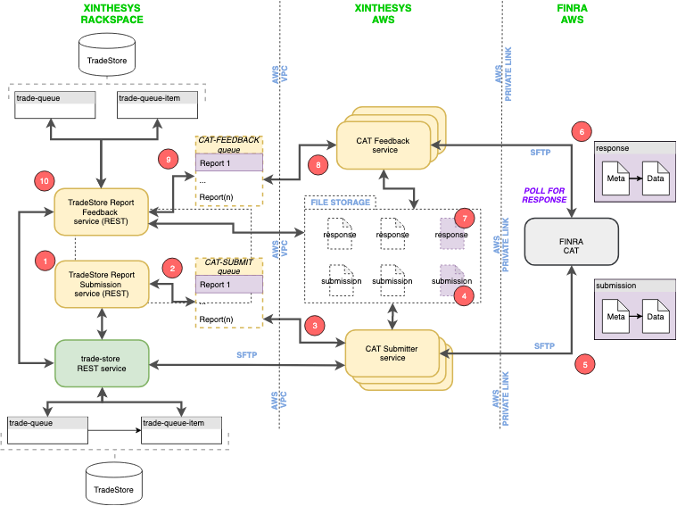

[Home](../README.md)
# Adept(tm) FINRA CAT Submitter Workflow

## Overview

The Adept FINRA CAT Submitter service responsibility is to package and submit trade report events into FINRA. It acts as a shared service across the domain. The service runs in the background and awaits for data from redis queue to process the submission.

### Shared service and how this service is used across the domains

The advantage of a submitter being shared domain is that we don’t have to create a separate submitter service for a number of domains. The overhead of handling multiple submitter services can be avoided by using a shared domain. For n number of domains there will be only one submitter service

Each domain will schedule the submission either by providing the trade report id or by the scheduled submission date, this information will be pushed by each domain into a shared Redis queue hosted in the system domain. The submitter service will be listening to the redis queue in the system domain for data.

Once the submitter service receives the data, It will look for the domain configuration file to get the database and other information that is required for submission.

Based on the configuration read, the service will read and package the data into file adhering to the cat-reporting-technical-specifications-for-industry-members-v2.2.1-r3 specification. Once the files are generated and the corresponding fields are updated in the domain database, these files will be submitted into FINRA through SFTP. The process is explained in detail under the section "How FINRA submissions work".

### Deployment model for the service and how internal servers communicate

- This service requires the following to be installed or made available before running it.

  * xdata.dom1 configured to domain IP
  * bzip2 linux command
  * node.js
  * npm
  * pm2
  * git

The deployment model consists of 2 services running namely adept-paas.finra-cat-submitter and adept-paas.finra-cat-receiver service. These both services are run as PM2 daemon running in the background. The submitter service requires bz2 linux command to package the submission files and submit it to FINRA. This service then connects to mongodb and redis from xdata.dom1 which is configured in /etc/hosts.

### Notifications / Logging

This submitter service has a logging and notification mechanism built in. Whenever the service receives data from the redis queue, or when there is a submission which is getting processed, or when it uploads to FINRA SFTP server, or doing any DB updates all these are logged in to a file which can be accessed anytime. When the service fails to process any submission or if it's unable to upload the submission file to the FINRA server those exceptions get notified in the specified slack channel. The slack channel to use for notification is configured in the utils directory.

For any dev related logging, or exception in a piece of code or error in process of submission the slack channel named #finra-reporter-events-dev get notified. If there are any successful submission that gets reported and notified into #finra-reporter-events channel. These all the channel names, the data to send can all be configured.

## Design

Stages of the data flow of the service.

#### XINTHESYS

In this stage the service gets invoked via REST API service or passing data through the redis queue. The data sent can be an array of trade report id’s or scheduled submission date of the trade report. At this stage when passing data to the service it sanity checks for only valid reports i.e only those reports whose status is not pending for submission. The data which is passed through also carries for which domain the processing needs to happen.

#### AWS

In this stage the service processes the received trade report ID's or the scheduled submission date. It then queries the DB for all the relevant trade events and trade report events that need to be processed. It then gets all the JSON records and writes into a .json file with a new line delimited that means each line has only a single record per line. After writing to the file it then bundles that file to .bz2 compression with linux command bz2. After compressing the file it then denotes the hash for the compressed file and puts that details into a file called meta.json which contains the hash of the compressed file along with the number of records that is being sent for submission.

#### FINRA


This is the final stage of the process. At this point the report is submitted to the FINRA SFTP server and we don't have any control over the process. The FINRA team takes some time to verify those submitted reports and at a later point of time feedback is pushed into the SFTP server where we pushed the report for submission. Initially a quick feedback is received if there is any error in the naming the report file, or number of records mismatch if not a success status is returned. As soon as a feedback file is received the service downloads the feedback file from the SFTP server and stores the file content in trade-file-contents collection and the status of the feedback is stored in the trade-report collection.

### Design goals

#### The goal of the service are as follows:

* Ability to process submission parallely without any issue
* Process trade events and trade report events
* Handle the status of the trade report
* Seal the trade report for duplicate or further processing
* Bundle all the events
* Create a meta file with hash and number of events that is being submitted
* Connect to FINRA SFTP server and upload the submission file
* Update the DB

#### How FINRA submissions work?

This FINRA submission process adheres to cat-reporting-technical-specifications-for-industry-members-v2.2.1-r3 technical specification. In the mentioned PDF it has all the format and specs to create a submission report. By not adhering the format specified in the technical specification the submission will lead to failure and not get submitted into the FINRA. Therefore it is necessary to follow the guidelines and format described in the specification document.

Following are the checkpoints for creating a successful submission

* JSON records need to be new line delimited
* The compressed format should be .bz2
* The compressed hash and number of records should be specified in meta.json file
* Following the naming convention specified in the specification document.
* File size should not be greater than 1000mb if its is more than that it should be split

This FINRA submission process adheres to cat-reporting-technical-specifications-for-industry-members-v2.2.1-r3 technical specification. In this PDF it has all the details for how a submission file should be named and created. Let's begin with the naming of the submission file. The format for the file is submitterID_reporterIMID_CurrentDATE_linkageKey_OrderEvents_000001.fileFormat. And for meta json it is similar like previous but with extension .json. The .bz2 file contains all the trade events in line separated json in a single file. The meta file contains the hash of the .bz2 file along with a number of records that are being submitted. Both the .bz2 and meta json file are then submitted to the FINRA SFTP server for feedback.

### Data flows

The following diagram shows overall flow for FINRA submission and FINRA receiver service.



The submission process involves several phases/steps described below:

##### Phase 1 ( Invoking from the REST API/Scheduler )

In this phase an invocation happens from the REST API that can be from the UI(Frontend) or any other external service like cron scheduler. From the UI the user manually invokes it by clicking the appropriate trade report to submit. In that way the trade report ID is passed as an input to the service. When the cron scheduler invokes it just passes today's date for submission in this way it sends the current date to process and from there the service then queries the DB for the relevant trade report/s for the current date and starts processing.

##### Phase 2 ( CAT Submitter Queue )

After the API is called it goes to the CAT-SUBMITTER queue for processing. There can be multiple/parallel submission in the queue. The queue then fetches each report to process on to the CAT Submitter service. This service queries the DB as per the trade report ID or report submission date. It then fetches all the records from the trade report and creates a bundled .bz2 file and meta.json containing the information about the file. After the submission is done it triggers the DB Updater service for updating each trade-event and trade-report-event records.

##### Phase 3 ( CAT Submitter Service )

The CAT Submitter service is responsible for preparing the submission files. It fetches the trade report id or trade report submission date for processing. After it finds a suitable record it fetches all the relevant trade-event and trade-report-event mapped to the report id.

##### Phase 4 ( Packaging submission file )

The submission json is streamed from db records. As the stream of data is processing the MD5 hash is calculated. It then bundles the json file in .bz2 file extension using the native linux bz2 command. After the bundle is created it creates a meta.json file containing the hash of the bz2 and total number of records in the trade report to submit.

##### Phase 5 ( SFTP Uploading )

After the files are packaged the file is ready to send via SFTP server. The package service connects the configured sftp server and uploads to the upload directory of FINRA SFTP server.

The steps from 6 to 10 are documented in the CAT Receiver service.

## Installation and Running the service

[Preparation and running](./prepare.submitter.aws.vm.md)

## Notifications and Logging

This service logs all the important info and errors into the log file. It uses the inbuilt service logger using the service model package. For any report related info or error it publishes to the Xinthesy's #finra-reporter-events channel. The slack utility is configured in /src/utils/slack directory. If there is any network disconnection or failed upload it sends the notification to the specified slack channel.

# Folder Structure
  ```
  |-- docs
  |-- etc
  |-- files
  |-- src
      |-- cat-report.db.updater
      |-- cat-report.packager
      |-- cat-report.submitter
  |-- utils
      |-- json
      |-- slack
 ```
## Folder Details

### docs

This folder contains all the necessary documents for the service design and prototype. It has all VPN setup for AWS and private link configuration.

### etc

This folder contains the configuration to run and connect this service. This file forms the backbone for running the service any changes for the system first we need to configure in this file such as settings for SFTP, Redis queue and report details.

### files

This folder contains the packaged files before submitting. This is stored in the file location provided in etc configuration. There is no retention logic provided in this service yet.

### src

This contains all the source code to run this service

* cat-report.packager

This service is responsible for creating and packaging submission files and meta.json file of the bundled json with a number of records available in the trade report. It then seals the corresponding trade report status as sealed true to prevent further processing the same report twice. On processing it marks the status as Pending for submission and after it successfully uploads to finra server it marks the status to Submitted.

* cat-report.submitter

This service queries the DB as per the trade report Id or submission date. It then fetches all the records from the trade report and creates a bundled .bz2 file and meta.json containing the information about the file. After the submission is done it triggers the DB Updater service for updating each trade-event and trade-report-event records.

* cat-report.db.updater

This service in the background updates the DB after submitting to SFTP. It updates the spec_data.submission.dt for every trade-event and trade-report-events. And it updates the trade-report status to submitted
## Utilities

* json

This service is responsible for storing and retrieving domain map configuration from the file
reportKeys.json. Whenever there is a new submission a domain map is stored in the file reportKeys.json along with all the old mappings stored before the submission. This file is also used by receiver service to use the DB connection for corresponding domain processing

* slack

This service allows to send slack message for development and notification purpose

### etc/cat.submitter.config.json

This file is used for configuring the SFTP, output directory and other important aspects for submission. Below is an extract of the configuration which has been used.

```json
{
  "reportKeyFile": "../reportkeys.json",
  "domainmap": {
    "celadon": {
      "entityIds": ["CELADON:SPLN","CELADON:CPRM","CELADON:CLDN"],
      "dbHost": "xdata.dom1",
      "dbName": "adept",
      "dbPort": "27017"
    },
    "wedbush": {
      "entityIds": ["WEDBUSH:WEDP"],
      "dbHost": "xdata.dom1",
      "dbName": "adept-wedb",
      "dbPort": "27017"
    }
  },
  "outputFolder": "./files",
  "report": {
    "submitterID": "93010",
    "reporterIMID": "SPLN",
    "reportGroup": "000001",
    "catFileNumber": "000123",
    "specVersion": "2.2.1"
  },
  "sftp": {
    "host": "sftp-pl.ct.catnms.com",
    "port": 22,
    "username": "cat93010ftp",
    "password": "W3!com3_93010",
    "path": "/93010/cat/upload/",
    "retries": 100,
    "retry_factor": 2,
    "retry_minTimeout": 2000
  },
  "redis": {
    "retry": {
      "attempt": 100,
      "total_retry_time": 3600000
    },
    "url": "redis://xdata.dom1:6379/1",
    "inputQueue": "finra-submitter::packager::input",
    "outputQueue": "finra-submitter::packager::output",
    "dbUpdaterQueue": "finra-submitter::packager::dbupdater"
  }
}
```
### reportKeyFile

This is a flat file where all the mongo configuration for a report key is stored. Below is an example. Where "DSLHGR1NNOON" is the reportKey and its mapped to celadon domain with its own entity id's and mongo configuration to connect.

```json
"DSLHGR1NNOON": {
    "name": "celadon",
    "domainmap": {
      "celadon": {
        "entityIds": [
          "CELADON:SPLN",
          "CELADON:CPRM",
          "CELADON:CLDN"
        ],
        "dbHost": "xdata.dom1",
        "dbName": "adept",
        "dbPort": "27017"
      },
      "wedbush": {
        "entityIds": [
          "WEDBUSH:WEDP"
        ],
        "dbHost": "xdata.dom1",
        "dbName": "adept-wedb",
        "dbPort": "27017"
      }
    }
  }
```

### domainMap

It has the mapping for each domain with supported entity id's and mongo connection. Whenever the receiver receives a file from FINRA it looks for this domainMap mapping to connect the DB and process.

### outputFolder

This is where the packaging files are stored before submitting to SFTP. It contains the .bz2 and json file.

### report

This contains the constants related to SFTP submission like reporterIMID, submitterID, and other required configuration

### sftp

This contains the sftp configuration to connect and upload the submission files.

### redis

This contains the configuration to connect redis. And there are 3 queue used for internal purposes.

* inputQueue

    This queue is responsible for getting data from a scheduler or external API to process submission file.

* outputQueue

    This queue is responsible for giving instruction to the packager to bundle as .bz2 and json file and submit through the SFTP.

* dbUpdaterQueue

    This queue is responsible for making DB updates after submitting to SFTP.
